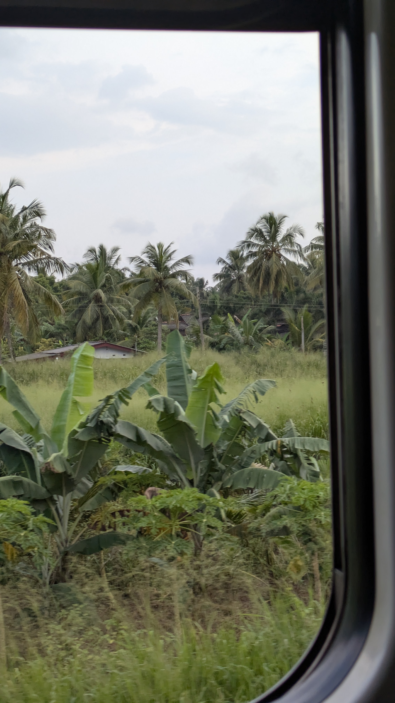

# Dominiks Quarterlife Travelblog

> I wrote a lot of text over the last months, so this is my 1-line Travel blog for my stay in Sri Lanka - Enjoy!

---

 Move to Kandy

1. Random Fact: I have read one book in the last 7 years (maybe 2), but I read another book in the last 2 days. Ladylike (very funny book) :) 
2. Pumpkin curry cooking class
3. Cabo with 3 Austrians and 10 extra rules
4. Buddhas Tooth temple - plot twist, you can't see the tooth - but hey good karma

5. a lot of school kids and everyone wanted to say hi 🙃🫠
6. 
7. anything you are looking for is at the next junction

Arrival + First impressions

1. "You like Bob Marley? The best weed is sold on the main street." - Ich weiß ja nicht.
2. TukTuk driving lesson at 3:30 am
3. Very cold night, due to the AC
4. Breakfast? How about a Burger
5. I had a cheese omelette for bf in the end
6. Greetings to Peter from the Netherlands, who also studied in Turku - what a coincidence 😂
7. Off to Kandy by train 🚂
8. 26 Grad und schwül - lässt sich aushalten
9. everything is soo greeeeen 
 

Ignore

 
Your content goes here.

