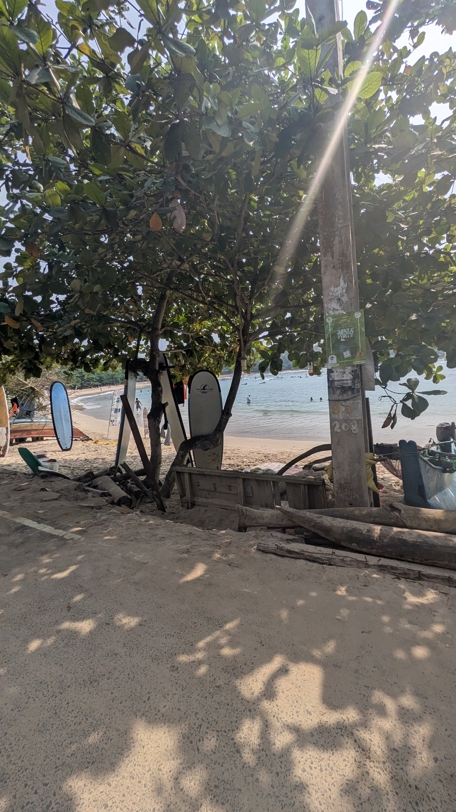
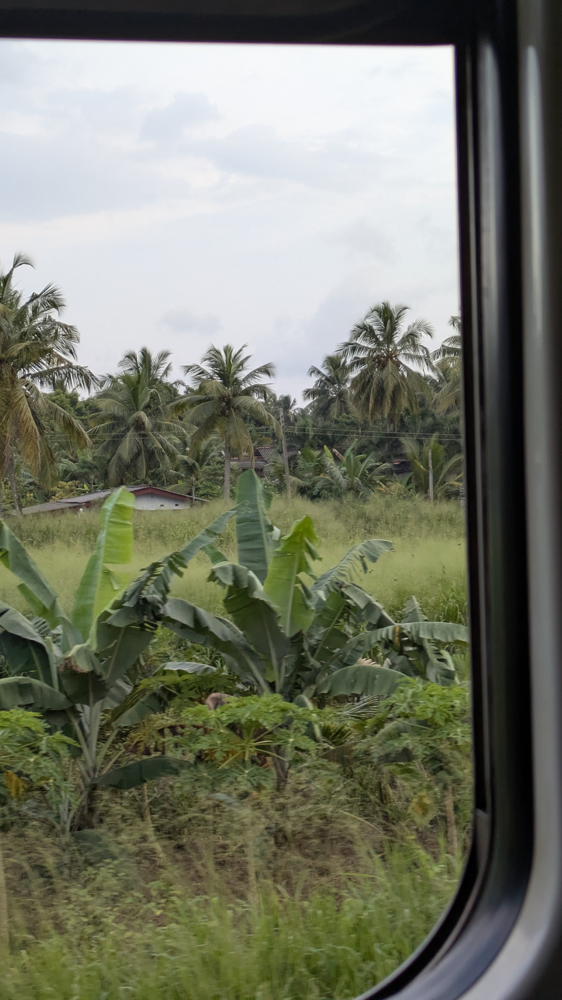

# Dominiks Quarterlife Travelblog

> I wrote a lot of text over the last months, so this is my 1-line Travel blog for my stay in Sri Lanka - Enjoy!

---

 How to spend the best last day in Sri Lanka 

1. 7am surf with damiano from italy
2. 10am yoga with everyone in the hostel
3. 11am just dance class with the swedish girls 
4. 11.30am big smoothie bowl and mango lassie with a swedish, an Indian and a canadian
5. 3-6pm heavy rain
6. 5pm Cabo with everyone at the hostel
7. 7.30pm open mic and pizza with the swedish group
8. 2€ bus ride to the airport
9. Getting the grade for your masters thesis

 Ahangama (next surf town)

1. The wave is called marshmellow
2. 7am surf, 8:30 breakfast 
3. Always movie rain in the evening
4. Watching Shrek
5. getting everyone hooked to Cabo
6. scratching my foot on the reef - ouch
7. Skate Bowl Party in the local skate shop

 Weligama surf town

1. Cappuccino with home made cashew milk
2. Town = a street
3. 1h board rental = 3,30€
4. Afternoon rain, rain, rain, rain, rain 

 Let's go south

1. Safari transfer to Hiriketiya 🐘
2. 6 am surf session, 7.30 breakfast smoothie bowl - what a start to the day
3. Sunset with a rainbow
4. CABO evening
5. Avocado Toast 

 From Kandy to Ella

1. hickup for breakfast, because of spicy 🌶️🔥 breakfast 
2. one of the most scenic train rides in the world 🚂
3. run to see the 9 arches bridge and little adams peak - no, I don't need a tuktuk
4. met a girl from finland, she was happy that I have such good memories of Finland - kiitos, kippis, korvapuusti
5. I am glad I didn't rent a tuktuk to get across the island - tom and the guy from Ulm told some dangerous storys 
6. woke up to a cold this morning, might have been to much, the last days - so I take a day off
7. so far I only ate local food

 Move to Kandy

1. Random Fact: I have read one book in the last 7 years (maybe 2), but I read another book in the last 2 days. Ladylike (very funny book) :) 
2. Pumpkin curry cooking class
3. Cabo with 3 Austrians and 10 extra rules
4. Buddhas Tooth temple - plot twist, you can't see the tooth - but hey good karma

5. a lot of school kids and everyone wanted to say hi 🙃🫠
6. 
7. anything you are looking for is at the next junction

Arrival + First impressions

1. "You like Bob Marley? The best weed is sold on the main street." - Ich weiß ja nicht.
2. TukTuk driving lesson at 3:30 am
3. Very cold night, due to the AC
4. Breakfast? How about a Burger
5. I had a cheese omelette for bf in the end
6. Greetings to Peter from the Netherlands, who also studied in Turku - what a coincidence 😂
7. Off to Kandy by train 🚂
8. 26 Grad und schwül - lässt sich aushalten
9. everything is soo greeeeen 
 

Ignore

 
Your content goes here.

